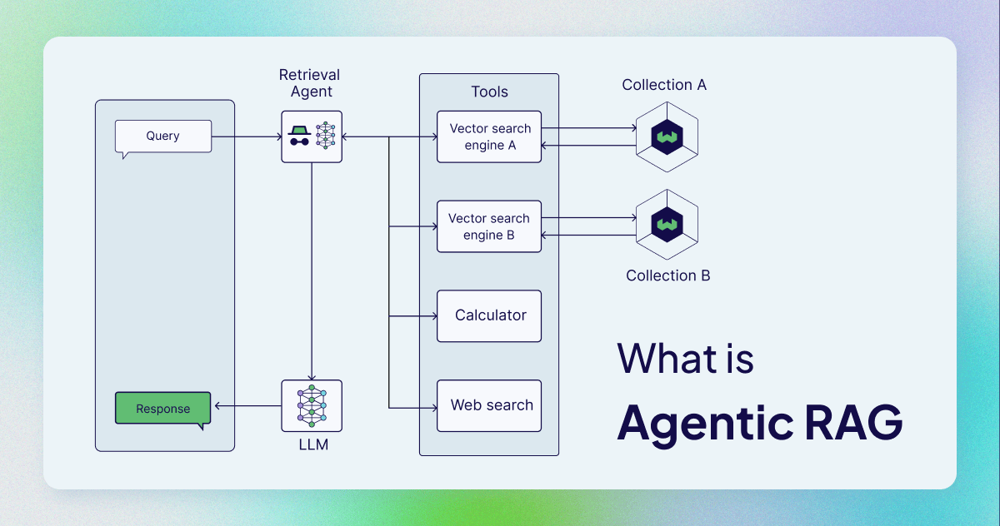
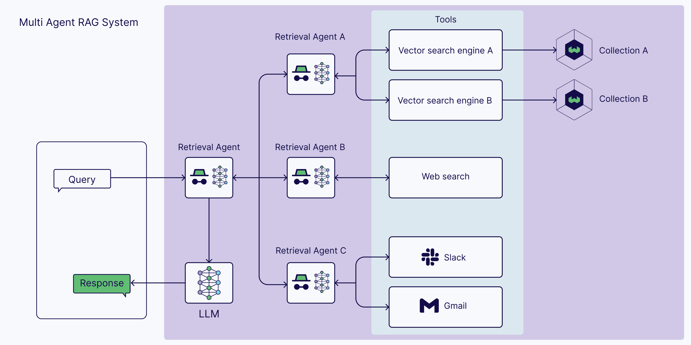

# 🧠 AI powered R&D - Notes on System Design & Other General Thoughts

> [!IMPORTANT]
> I'm penning down my thoughts as I think them through. As such, treat this
> document as a work-in-progress.

I believe that scoping this project out requires a good understanding of
Retrieval Augmented Generation. Wile RAG ain't nothing new, Since it sits at
the forefront of the AI hype train, the signal-to-noise ratio around RAG is
poor. Here's my thoughts on based on some reading I'm doing

## [What is Agentic RAG](https://weaviate.io/blog/what-is-agentic-rag "What is Agentic RAG - Article By Weaviate")

### 📚 Vanilla RAG

> 

- Naive RAG considers only one external knowledge source.
- One shot retrieval (based on embedded query against embedded+chunked
  documents) to provide context to LLM to generate a response
- You could implement re-ranking post retrieval, but once results are
  finalized, then iteration over the results to ensure goodness-of-fit is
  tedious.
- Process flow of Vanilla RAG
  - Documents chunked and vectorized using an embedding model, then stored in a
    vector DB
  - In-coming user queries are embedded with same embedding model, then
    compared against vectorized documents to get top_k similar
  - Retrieved documents are collected (potentially reranked) and provided to
    the LLM along with the query as context
  - LLM generates a response that factors in the query along with the context
    containing the retrieved documents

### 🕵️ Agents in AI

- In a nutshell, agents are LLMs with a role (that have access to memory and
  external tools).
- Reasoning ability of LLMs allow it to plan and act to complete tasks
- Some notable components of agents are
  - LLM (with defined role & task)
  - Memory (short-term & long-term)
  - Planning (eg. reflection, self-critics, query routing etc)
  - Tools (eg. web-search, bash-command-execution etc)
- The ReAct (Reason + Act) Framework is used to demonstrate how Agents behave
  ")
  - Thought: Receive user query to then being reasoning about a plan for the
    next action
  - Action: Agent decides an action and executes it.
  - Observation: The Agent observes feedback from the action.
  - Repeat until task is completed.

### 🔄 Agentic RAG

- Atomic unit of an Agentic RAG graph is the agent.
- These agents can vary in complexity, but they are essentially role & task
  constrained LLMs with the ability to use tools/functions and have a feedback
  mechanism
  - Unpopular Opinions: An agent is basically a graph (within the larger Graph)
- Here's some examples of agentic RAG systems
  - Single Agent RAG (router)
    
  - Multi Agent RAG Systems
    

### Vanilla vs Agentic RAG

> [!NOTE]
> Weaviate's analogy comparing the two.
>
> Vanilla RAG = Being at the library (before smartphones existed) 📚
> Agentic RAG = A smartphone in hand, with included web-browser, calculator, other tools... 📱

## 💭 To Abstract or Not To Abstract, That is the Question

I've used langgraph, langchain, and have seen e-folk post about Crew-AI. I can't
help but get a whiff of SF-Software-Bro from the discourse surrounding the use
of LLM orchestration frameworks.

A few serious ML practitioners in my circle seem to share this scepticism. Do
we need these complicated abstractions, wrappers around every emerging tool,
and an unjustified amount of bloat for what could otherwise be written in
simple, easy-to-debug code?

Having built with Langgraph before, it's certainly better than the
dumpster-fire that is Langchain, but it still had me feeling that at its core,
it was just chaining python functions in a user-defined flow (with shared
state, tool use capabilities and feedback loops). A noticeable chunk of LLM
enthusiasts on Reddit seem to be similarly jaded about the the needless
complexity using these frameworks adds to your system.

I recently came across a few frameworks that market themselves as the promised
scratch to the LangX induced itch. I'm talking about [Atomic
Agents](https://github.com/BrainBlend-AI/atomic-agents) and
[PocketFlow](https://github.com/The-Pocket/PocketFlow). For the scope of this
project, I might find myself constrained to explore only one of these
frameworks. PocketFlow is my pick, since it's impossibly lightweight
implementation (100 lines of Python!) tipped the scale in its favour.

## 🚀 Pocket Flow

Here's the pitch for Pocket Flow (lifted from its [website](https://the-pocket.github.io/PocketFlow/))

- **Lightweight**: Only core graph abstractions
- **Expressive**: Everything the big-boys can do, this tiny behemoth can (Multi-Agents, RAG, Workflows etc)
- **Agentic-Coding**: The library is lightweight and intuitive enough to make it a prime candidate for agentic coding.

> [!NOTE]
> I'm aware that the simplicity could lend itself to tighter plan-execute-debug agentic coding cycles.
> I'm more interested in it owing to its stripped down nature, where you get to work much closer to actual Python.

## 📋 Assignment Description

Develop a simple demo of an AI assistant for research and development. Starting
from a description of a problem, the assistant should be able to:

1. ✨ Generate research ideas for addressing the problem.
2. 🔍 Assess the novelty of an idea w.r.t. relevant literature.
3. 🧪 Suggest experiments to validate a research idea

> [!NOTE]
> Example inputs:
>
> _"Current image generation models often struggle with accurately generating
> hands. How could I go about improving these models to fix this?"_
>
> _"Current high-performance chips for running AI models i.e. GPUs, TPUs
> consume a large amount of power. What are some potential research ideas for
> building chips with similar computational capability but lower power
> consumption?"_

Feel free to use any of your preferred APIs you need to build the demo (e.g.
OpenAI APIs or 3rd party search APIs).

We are interested in your thought process approaching this problem, the design
choices you make, and the quality of your code.

You may use AI coding assistants to complete this task, but please let us know in
the interview how you have used them.

We expect you to spend 6 hours or less on this task. We are not expecting a full
solution but an MVP and proposed architecture for a more comprehensive
solution.

At least 24 hours before the interview, please share with us:

1. A repo with your solution As a Jupyter notebook or a Python script)
2. A short document 1 page) sharing your thoughts, overview of the approach
   and assumptions made

## System Design

Iterating through possible system design specifications in this [document](./system_design_openai_deep_research.md)
